# WYSIWYG Message Editor

Prepared by SRF Consulting Group Inc.

## Introduction

The WYSIWYG (*What You See Is What You Get*) message editor makes it easy to
incorporate graphics, color elements and sophisticated text layouts, allowing
[DMS] to be utilized to their full potential.

The user interface is designed to be intuitive and easy to use for both new
users and sophisticated administrators.  It enables users to:

- Enter and edit text
- Control [font], color and justification of text
- Insert, resize or delete *text* and *color rectangles*
- Place images, with easy placement and editing of location
- Make [action tag]s easy to insert and configure

### Planning Your Message

Before creating or editing a message, it's advisable to verify several items to
ensure that your message will display properly.  Making a sketch of your
message can help you identify sign resolution requirements, the availability of
graphics and the space needed for [action tag]s that have variable number of
characters.  Items to check include:

- Signs of different size and resolution can be included.
  Does the content of message fit on the sigs where you want to use it?
- Only [graphic images] in the library can be used in messages.  Are all images
  you want to use loaded in the IRIS image library?
- If you want to use color (fonts, rectangles, or images) does the sign where
  you'll use the messages support color?
- There are recommended physical sizes for the letters in message on a sign,
  for example approximately 14 inches tall for messages on signs located on an
  interstate.  Does your choice of font meet these requirements?

By planning your message, you can use the editor to quickly create
communicative, attractive messages for roadside DMS.

## Launching the Editor

The editor can be accessed in one of two ways:

1. Select `View ➔ Message Signs ➔ Message Editor` menu item.
   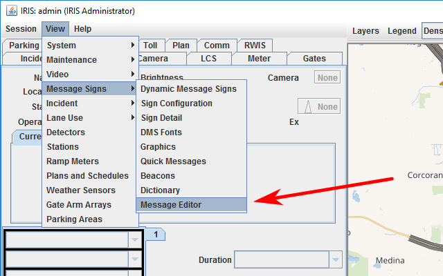
2. Or, right click on any sign and select `Message Editor` in the context menu
   

Once the editor is launched, the Message Selector window will appear.

You can now select a sign to get a list of existing messages.  If you want to
edit a message, select it from the list and a preview will appear.

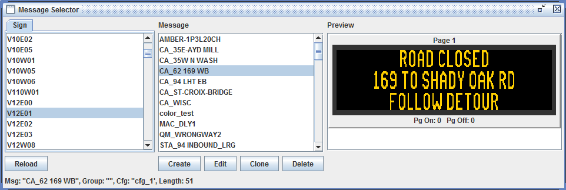

## Creating or Editing a Message

Only users with the `dms_admin` role have the necessary permissions to create
or edit messages.  Editing will only be enabled if [edit mode] is turned on.

- To edit an existing message, select it in the `Message` list and click `Edit`.
- To create a new message, click `Create`.
  1. A window will appear asking you to give your new message a name.
  2. Type in your message's name and click `OK`.

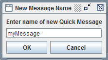

You can now enter text, insert graphic elements, create complex layouts or use
[action tag]s in your message.  Each of these features is described in the
sections below.

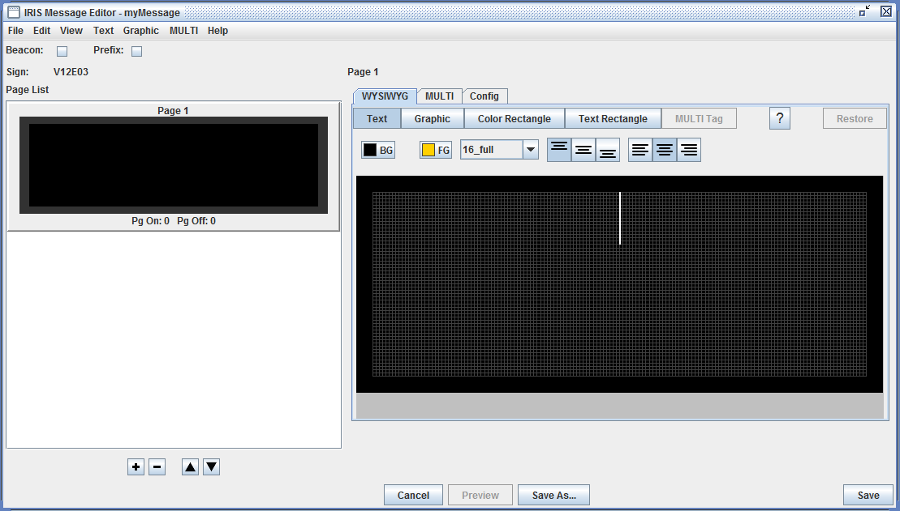

### Save

A `Save` button is located at the bottom right of the editor window.  Clicking
it will immediately save the message using the current name, this action cannot
be undone.

### Save As

A message can be saved under a new name using `Save As` button.  It is located
at the bottom of the editor window.  Clicking it will open a window where you
can enter a new name for your message.

## Sign Pages

You can easily add, remove and re-order pages for signs in the editor.
Multi-page messages are commonly used to display more information that can fit
on a single page or create pseudo-animation style effects.  Page previews and
controls are located on the left side of the editor window.


To add a new page, click the `+` button.  To remove a page, select it in the
page list and click the `-` button.  The page selected in the list is
automatically put in the editing window on the right.

To reorder pages, use the arrow buttons next to the page add/remove controls.
Selecting a page and clicking `▲` will move the page up one in the sequence,
`▼` will move the page down one position.

## Working With Text

Entering text on a sign can be as simple as clicking on the edit window and
typing or can use complex layouts of multiple, independently positioned text
rectangles with different fonts and colors.  The editor makes creating and
combining elements a simple point-and-click operation.

### Basic Text Entry

For a basic text message, just click on the sign in the editor.  The text cursor
will appear at a location for text based on the default vertical and horizontal
positions for the sign.  Text will be entered using the font.

Information messages on roadside DMS typically use basic text with an
amber-on-black font, center justification and center vertical positioning.

To edit text on the sign, click the `Text` button.

### Justifications, Color and Fonts

More complex layouts are easily created in the editor.  Text justification can
be changed by either highlighting a section of text or placing the cursor before
the text to be changed and clicking the left, right, or center justification
button.


If you enter text that is larger than can fit on the sign, the color will
change to purple.

Clicking on the `BG` button will open a color picker tool, allowing the
background color to be adjusted.  Select the desired color and click `OK` to
apply it to your message.

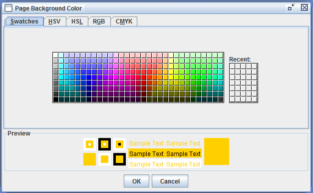

Text color can be changed by highlighting a section of text and clicking the
`FG` button.  When the color picker tool appears, select a color and click `OK`
to change the text color.

### Text Rectangles

More complex message layouts can be created with text rectangles.  These are
regions on the sign that can have their own text attribute.  Text rectangles
can be any size and be placed anywhere on the sign layout.  Messages can have
multiple rectangles on a single page.

To insert or edit a text rectangle, select the `Text Rectangle` button.
Place the cursor anywhere on the message and drag to the opposite corner of the
rectangle you want to create.  The cursor will then move to the default position
for text within the rectangle.


All text controls can be used within the text rectangle.  Font, color,
justification and position can all be changed.  The rectangle itself can be
moved or resized in the message by selecting it and either dragging it to a new
position or clicking on the resizing "handles" on the outline of the rectangle.

## Working with Graphic Elements

Two types of graphic elements can be added to DMS messages: *color rectangles*
and [graphic images].  These can be used to emphasize portions of a message or
can be images such as interstate number shields, warning pictographs or other
signs.  Either element can be easily added by clicking the appropriate button
in the editor window.

### Color Rectangles

Color rectangles can be any size from one pixel to the entire valid area of the
sign.  To insert one, click the `Color Rectangle` button, then click on the sign
where you want the rectangle to appear and drag the cursor to the opposite
corner.

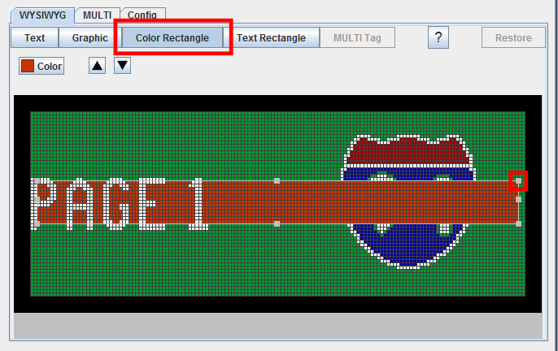

The color rectangle will appear on the page.  The rectangle can then be moved or
resized in the message by selecting it and either dragging it to a new position
or clicking on the resizing "handles" on the outline of the rectangle.

The color of the rectangle can be changed by clicking on the `Color` button.
Click on the desired color and click `OK` to apply.

### Graphic Images

If placing an image on a roadside sign, consider restrictions for traffic
control devices that may affect the design of your graphics.  For example, if
a speed limit sign is to be displayed, it must conform to the black text on
white background (or reverse) sign convention.

#### Preparing

The message editor can only load [graphic images] from the IRIS image library.
Also, images must have vertical and horizontal dimensions equal to or less than
the sign on which they will be used.

#### Using Graphics

To place a graphic in your message, click the `Graphic` button in the editor
window.  Available graphics for your sign will appear in the drop down list.
To insert the selected graphic, click on the `Add Graphic` button.


You can then click on the inserted graphic and drag to any place on your message
layout.

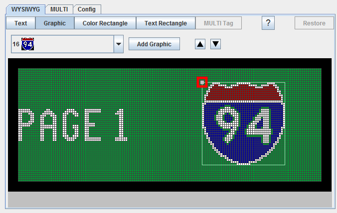

### Ordering Graphic Elements

Graphic elements have an effective front-to-back *order* in your message.  For
example, adding a graphic and then a color rectangle can cause the graphic to be
obscured by the rectangle in front.

This can be corrected by selecting the `Color Rectangle` button to edit the
rectangle, then using the `▼` *order* button.  This will move the rectangle
*back* in the message.  Conversely, the `▲` button moves the selected element
*forward*.

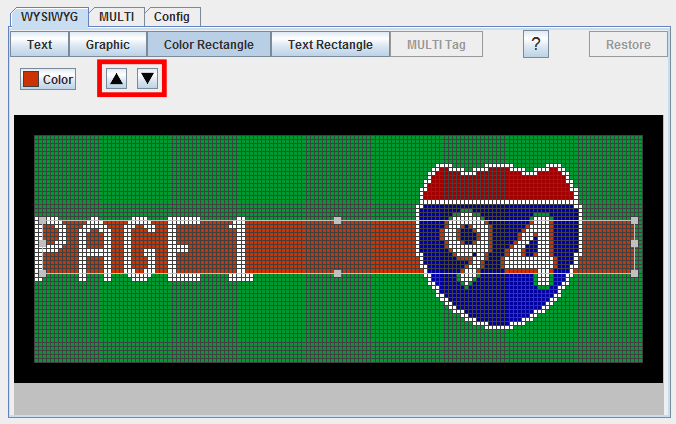

Note that the text element will always appear on top, or first in the front to
back order in the message.

## Action Tags

In addition to the standard [MULTI] tags used for formatting messages, IRIS
supports several [action tag]s that allow you to place live data on message
signs.

The message editor allows you to place, edit and preview *action tags* in your
message without having to set parameters directly in the MULTI tag.  In addition
to *action tags*, the editor allows you to manually insert any valid MULTI tag
and set its parameters (if any) by using the MULTI Tag function.

### Inserting

To insert an *action tag* into your message, first enter any text that will be
used with it.  For example, for a work zone or other sign to warn drivers that
there are slow moving vehicles queuing text such as:

```
SLOW TRAFFIC
XX MILES
USE CAUTION
```

Once your text is entered, click on the `MULTI Tag` button in the editor.

The `MULTI Tag` controls will appear.  To insert an *action tag* (or any other
MULTI tag), click on the drop down list at the left of the controls, select your
desired tag, and click the `Add Tag` button.


A dialog will appear prompting you to set any parameters valid for your selected
tag.


Enter these as appropriate for your message and click `Add Tag`.  *Action tags*
will appear as green placeholder items as the actual data in the message will
vary based on real-time conditions.


### Setting Parameters

[MULTI] tag and [action tag] parameters can be edited after the message is
saved.  To set parameters, select the message, click on the `MULTI Tag`
button, then click on the placeholder for the tag.

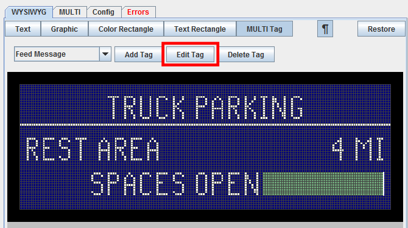

In the MULTI tag controls, click on `Edit Tag`.  A dialog will appear allowing
you to set the parameters for the selected tag.  To save your new settings,
click the `Accept` button.

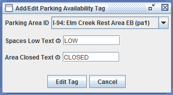

## Information Views

The editor includes two information views that can assist with creating
*WYSIWYG* messages by providing detailed information about the MULTI code
generated by the editor and the target sign.

### MULTI View

When messages are created in the WYSIWYG view, the editor automatically creates
the code that will be stored and sent to the sign when the message is displayed.
This code (called [MULTI]) can become very long and complex for more
sophisticated messages.

The editor provides the MULTI view to directly examine and edit code.  This can
be useful if a WYSIWIG operation isn't producing the desired output, or if a
user wants to set values for position, color or [action tag] options manually.

The MULTI view is accessed by clicking on the `MULTI` tab.  The code can be
viewed as a single line, which is how it is stored and transmitted to signs or
viewed with line breaks inserted to improve readability.  All readability tweaks
are removed when the message is stored.

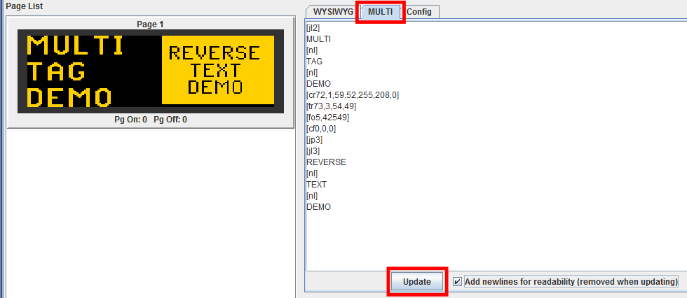

If the message is edited in the MULTI window, click `Update` to render the
changes you've made.

### Configuration View

Knowing the details of a sign's configuration is helpful when planning to insert
graphics. To see this information, click on the `Config` tab.  The sign's
dimensions, color capabilities, resolution and default font information is
available.

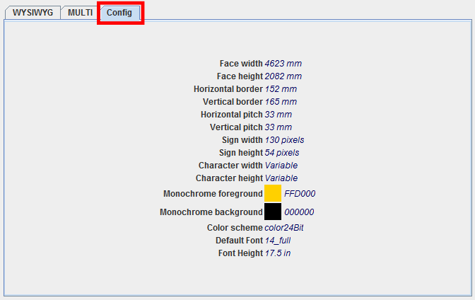

## Keyboard Shortcuts

Keys                             | Function
---------------------------------|---------
<kbd>Ctrl</kbd>+<kbd>Enter</kbd> | Insert a new page after current page
<kbd>Ctrl</kbd>+<kbd>Shift</kbd>+<kbd>PageDown</kbd> | Insert a new page after current page
<kbd>Ctrl</kbd>+<kbd>Backspace</kbd> | Delete by word/tag to left
<kbd>Ctrl</kbd>+<kbd>Delete</kbd> | Delete by word/tag to right
<kbd>Alt</kbd>+<kbd>PageUp</kbd> | Move page(s)/region(s) up in list
<kbd>Alt</kbd>+<kbd>PageDown</kbd> | Move page(s)/region(s) down in list
<kbd>F2</kbd> | Open edit-parameter dialog for selected element(s)
<kbd>F6</kbd> | Toggle between WYSIWYG and MULTI editor-modes
<kbd>F7</kbd> | Toggle between normal and visible tag-edit modes
<kbd>Ctrl</kbd>+<kbd>Z</kbd> | Undo last change
<kbd>Ctrl</kbd>+<kbd>Y</kbd> | Redo last undo
<kbd>Ctrl</kbd>+<kbd>Shift</kbd>+<kbd>Z</kbd> | Redo last undo
<kbd>Ctrl</kbd>+<kbd>Shift</kbd>+<kbd>S</kbd> | Save As...


[action tag]: action_plans.html#dms-action-tags
[DMS]: dms.html
[edit mode]: ui.html#edit-mode
[font]: fonts.html
[graphic images]: graphics.html
[MULTI]: multi.html
